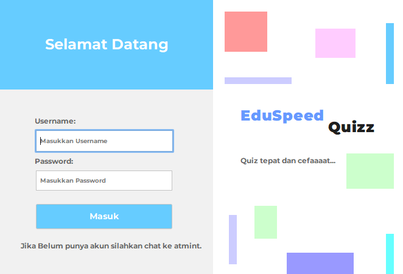

# 🎓 Quiz Application (Java Swing & MySQL)

A desktop-based **Quiz Management System** built with **Java Swing**, **Maven**, and **MySQL**.
This application supports **student and lecturer dashboards**, quiz management, and database-driven questions.

> 📌 Created as an academic project and designed to be **portable**, **easy to run**, and **presentation-ready**.

---

## ✨ Features

### 👨‍🎓 Student Dashboard

* View available quizzes
* Take quizzes
* Submit answers
* Automatic scoring

### 👨‍🏫 Lecturer Dashboard

* Manage quiz list
* Add / edit quiz questions
* View quiz data

### ⚙️ General

* Java Swing GUI
* MySQL database integration
* Maven dependency management
* Clean project structure
* Portable via GitHub

---

## 🛠 Tech Stack

| Technology | Description                   |
| ---------- | ----------------------------- |
| Java       | Programming language          |
| Java Swing | Desktop GUI                   |
| Maven      | Build & dependency management |
| MySQL      | Database                      |
| GitHub     | Version control               |

---

## 📂 Project Structure

```
Quiz/
├── pom.xml
├── src/
│   ├── main/
│   │   ├── java/
│   │   │   └── com/mycompany/quiz/
│   │   └── resources/
│   │       └── images/
├── database/
│   └── quiz.sql
└── README.md
```

---

## 🗄 Database Setup

### 1️⃣ Import Database

1. Open **phpMyAdmin**
2. Create a database (example: `eduspeed_quiz`)
3. Select the database
4. Click **Import**
5. Choose file:

   ```
   database/eduspeed_quiz (2).sql
   ```
6. Click **Go**

✔ Tables and data will be created automatically

---

## 🔌 Database Configuration

Edit the database connection in `Koneksi.java`:

```java
String url = "jdbc:mysql://localhost:3306/quiz";
String user = "root";
String pass = "";
```

> ⚠️ Make sure MySQL service is running before launching the app

---

## ▶️ How to Run the Application

### Using NetBeans (Recommended)

1. Open NetBeans
2. Click **Open Project**
3. Select the project folder
4. Wait for Maven to load dependencies
5. Right-click the main form
6. Click **Run File**

---

## 🌐 Clone This Repository

```bash
git clone https://github.com/expectcube/Netbeans-EduSpeedQuizz.git
```

---

## 📌 Notes

* This project uses **Maven**, not Ant
* Images are stored in `src/main/resources`
* Database is provided as an SQL dump
* Internet connection may be required on first build (Maven dependencies)

---

## 📸 Screenshots

### 🔐 Login Page


---

## 📜 License

This project is intended for **educational purposes only**.

---

## 🙌 Author

**oreocube**
Academic Project – Java Desktop Application

---

⭐ If this project helps you, feel free to give it a star!
